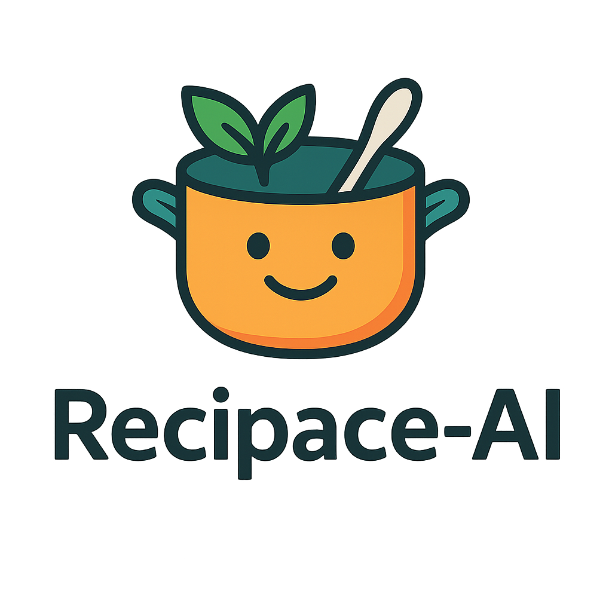

# 🥣 Recipace-AI



**Recipace-AI** is a Streamlit-powered web app that leverages Google’s Gemma 3-27B model to auto-generate richly detailed, one-of-a-kind recipes for YouTube food creators. In one click you’ll get:

- **Full Recipe**: Title, ingredients, cooking method, step-by-step guide  
- **Chef’s Insights**: Pro tips, plating suggestions, common pitfalls  
- **YouTube Script**: Ready-to-use intro, narration, and outro  
- **Grocery List**: Shopping list grouped by category  
- **Timers**: Prep & cook step estimates  
- **Nutrition Facts**: Macro & micro breakdown  
- **Substitutions**: Flexible ingredient swaps  
- **Scaling & Conversion**: Adjust servings; switch Imperial/Metric  
- **Save & Download**: Export as `.txt` or richly formatted `.docx`  
- **Session Library**: Save favorites for later  
- **One-click Tweet**: Share a snippet on Twitter  

---

## 📖 Table of Contents

1. [Project Overview](#project-overview)  
2. [Tech Stack](#tech-stack)  
3. [Screenshots](#screenshots)  
4. [Installation & Local Setup](#installation--local-setup)  
   - [Prerequisites](#prerequisites)  
   - [Clone & Virtual Environment](#clone--virtual-environment)  
   - [Install Dependencies](#install-dependencies)  
   - [Configure Environment Variables](#configure-environment-variables)  
   - [(Optional) Seed or Update `recipace.json`](#optional-seed-or-update-recipacejson)  
   - [Run the App Locally](#run-the-app-locally)  
5. [Usage Guide](#usage-guide)  
6. [Parameter Configuration](#parameter-configuration)  
7. [Advanced Features & Workflow](#advanced-features--workflow)  
8. [Project Structure](#project-structure)  
9. [Troubleshooting](#troubleshooting)  
10. [Contributing](#contributing)  
11. [License](#license)  
12. [Contact & Follow](#contact--follow)  

---

## 🧐 Project Overview

Recipace-AI addresses the creative overhead for food content creators by auto-drafting broadcast-ready recipes **and** all accompanying materials in seconds. Spend less time planning and more time cooking (and filming)!

---

## 🛠 Tech Stack

- **UI**: Streamlit  
- **LLM Backend**: Google Generative AI (Gemma 3-27B) via `google-generativeai`  
- **Language**: Python 3.8+  
- **Data**: `recipace.json` for parameter definitions  
- **Doc Export**: `python-docx` for Word (.docx) output  
- **Config**: `python-dotenv` for secret management  

---

## 📸 Screenshots

<details>
<summary>:film_strip: Click to expand screenshots</summary>

1. **Header & Logo**  
     
2. **Parameter Accordion**  
     
3. **Generated Recipe & Extras**  
     
4. **DOCX Export Preview**  
     
</details>

---

## ⚙️ Installation & Local Setup

### Prerequisites

- **Python 3.8+** installed (`python --version`)  
- **pip** (package installer) (`pip --version`)  
- **Git** (`git --version`)  

### Clone & Virtual Environment

```bash
# 1. Clone this repo
git clone https://github.com/your-username/recipace-ai.git
cd recipace-ai

# 2. Create a virtual environment
python3 -m venv venv

# 3. Activate the venv
# macOS / Linux
source venv/bin/activate
# Windows (PowerShell)
.\venv\Scripts\Activate.ps1
